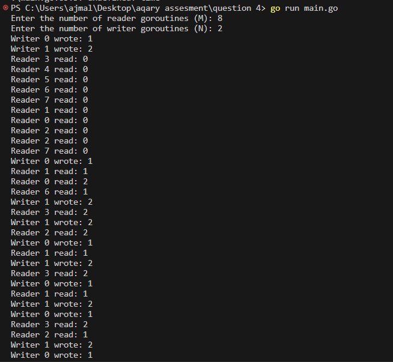
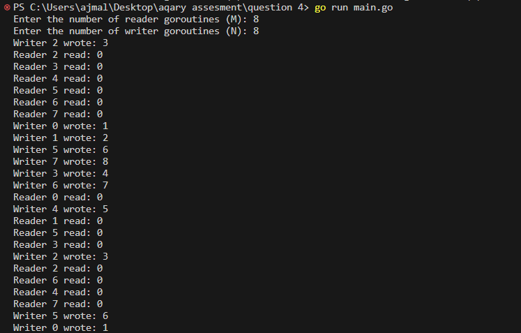
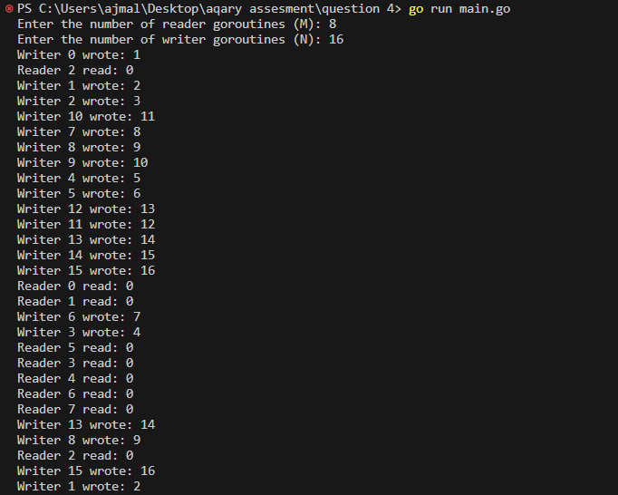
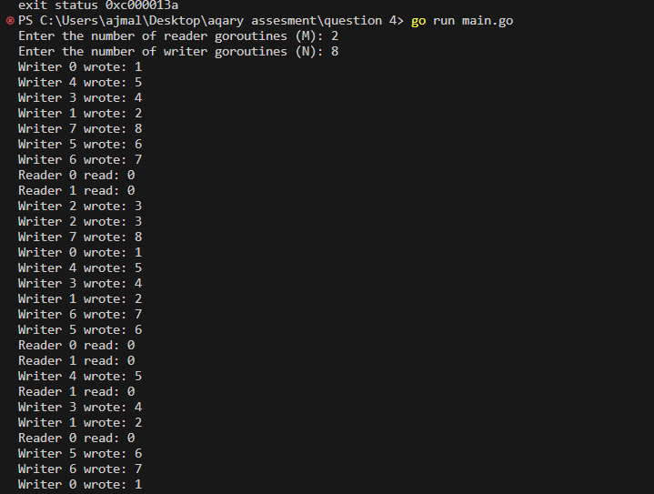

# aqary-question-4
Assesment question number 4 given by aqary international group

// here added some delay for proper output analysis

Question# 4

Assume there are M goroutines reading from a shared buffer (such as a byte slice) and N goroutines writing into it. How to avoid deadlock and race condition?
The goroutines are always running and there is no wait group. Using wait groups is not allowed.
Solve for M = 8 and N = 2
Solve for M = 8 and N = 8
Solve for M = 8 and N = 16
Solve for M = 2 and N = 8

Output:-

1:- Solve for M = 8 and N = 2

2:- Solve for M = 8 and N = 8

3:- Solve for M = 8 and N = 16

4:- Solve for M = 2 and N = 8

